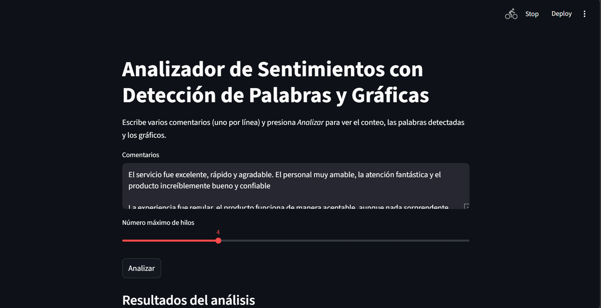
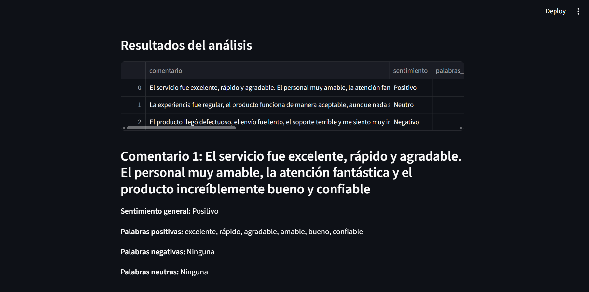
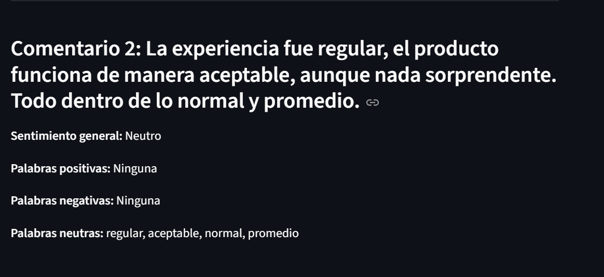
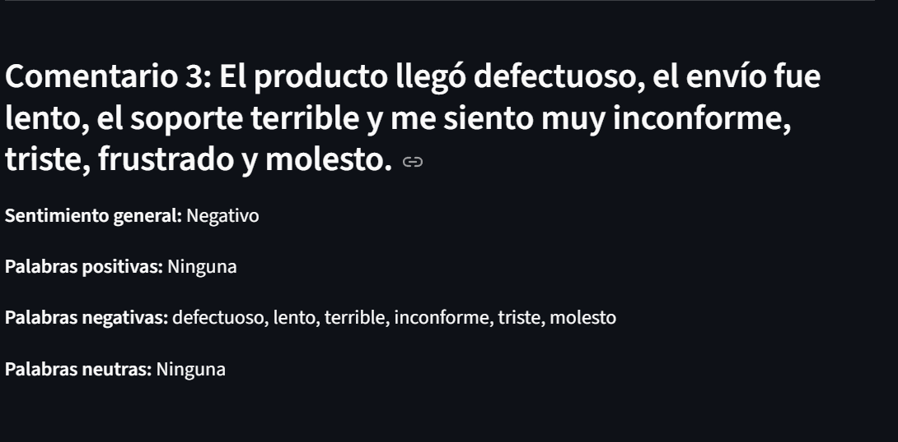
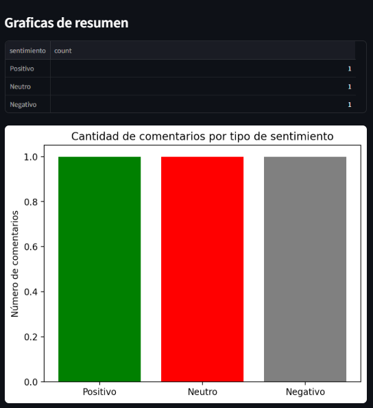
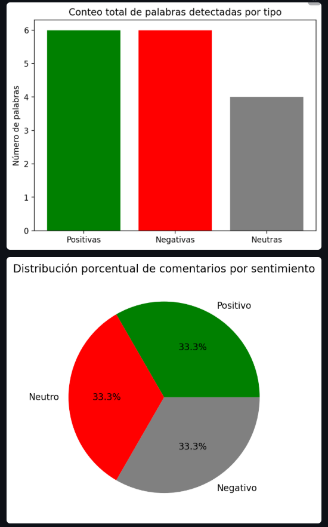
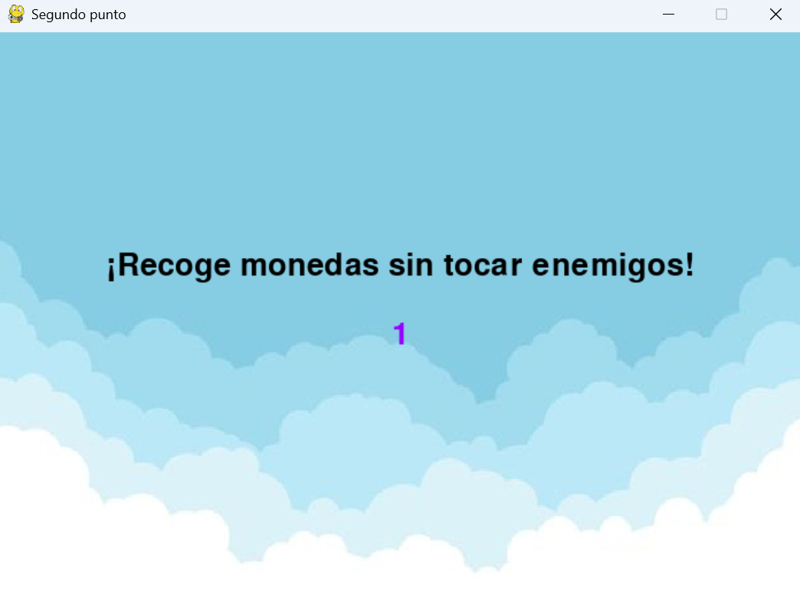
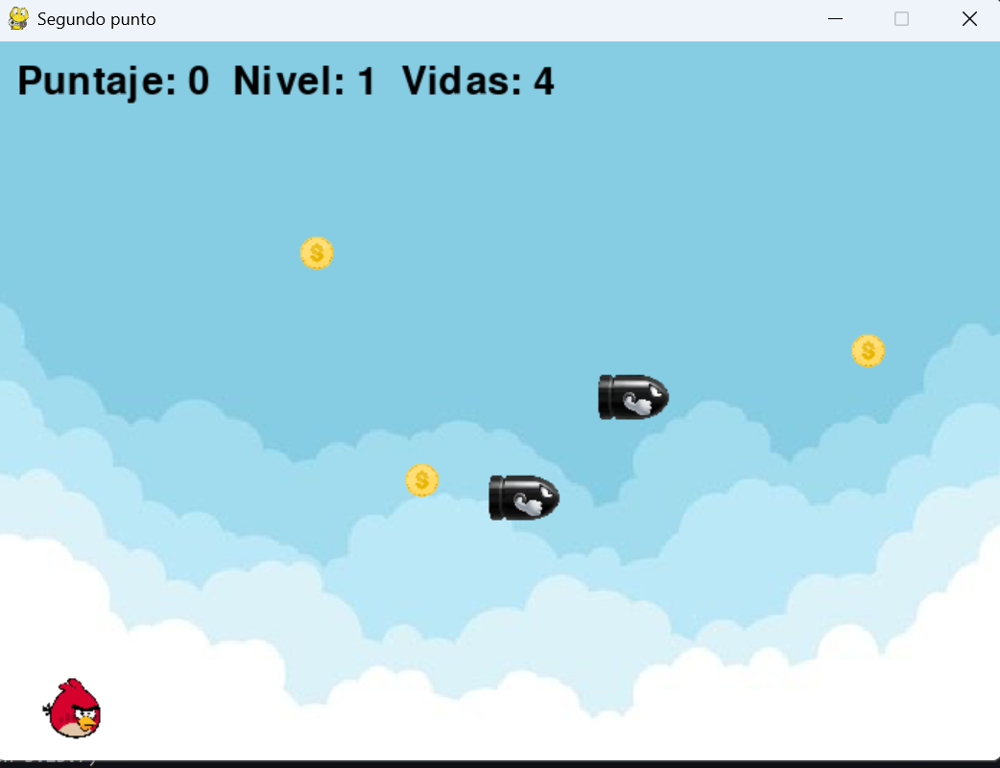
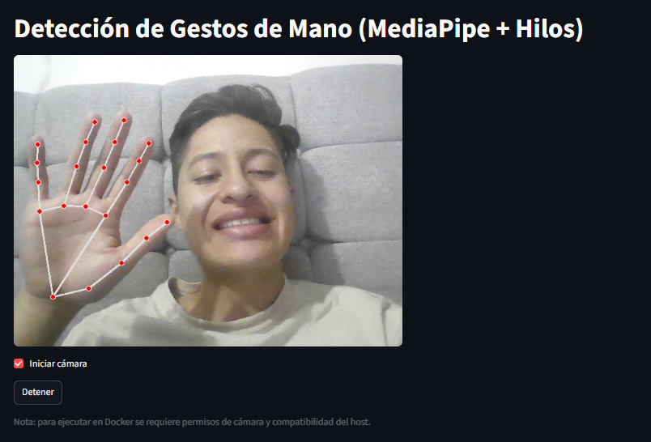
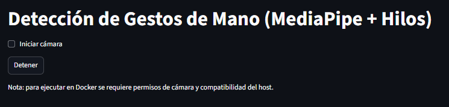

# Proyecto Final: Implementación de Hilos en Python (Multithreading + Docker + Streamlit + MediaPipe)

Este repositorio contiene **tres ejercicios prácticos** que demuestran el uso de **hilos (multithreading)** en Python, aplicados a contextos de **análisis de texto**, **videojuegos 2D**, y **visión por computadora**.  
Cada punto incluye código funcional, manejo de sincronización, e integración con **Docker**.

---

## **Primer Punto: Ejercicio de Análisis de Sentimientos con Hilos**

### **Objetivo**
Procesar textos en paralelo para analizar emociones (positivo / negativo / neutro) utilizando **hilos** y desplegar resultados en una **interfaz visual con Streamlit**.

### **Descripción**
Cada hilo analiza un subconjunto de comentarios y determina el sentimiento usando un **diccionario de palabras**.  
Finalmente, los resultados se muestran en tiempo real con Streamlit.

### **Tecnologías**
- Python  
- ThreadPoolExecutor  
- Streamlit  
- Pandas  
- Docker  

###  **Ejecución local**
```
cd sentiment_analysis_threads
pip install -r requirements.txt
streamlit run app.py
```
### **Ejecución con Docker**
```
docker build -t sentiment-threads .
docker run -p 8501:8501 sentiment-threads
```
### **Vista previa de la aplicación**
  
  
  

  
  

## **Segundo Punto: Desarrollo de Juego 2D Tipo Mario Bros Implementando Hilos**
### **Objetivo**
Implementar mecánicas clásicas de plataformas (como Mario Bros) donde se gestionen varios procesos en paralelo usando hilos, mutex y secciones críticas.

### **Descripción**
Se desarrolla un mini juego en pygame, donde:

El jugador puede moverse y saltar.

Las monedas caen o se mueven gracias a hilos secundarios.

Se usan locks (mutex) para evitar condiciones de carrera.

### **Tecnologías**
- Python
- Pygame
- Threading
- Mutex / Lock
- Docker

### **Ejecución local**
```
cd platform_game_threads
pip install -r requirements.txt
python main.py
```
### **Ejecución con Docker**
(pygame necesita acceso al entorno gráfico; este contenedor se ejecuta mejor con X11 o entorno de escritorio.)

```
docker build -t platform-threads .
docker run --rm -it platform-threads
```
### *Vista previa del juego*
  
  
  


## Tercer Punto: Detección de Gestos de Mano Usando MediaPipe e Hilos
### **Objetivo**
Implementar un detector de gestos de mano en tiempo real usando MediaPipe y procesamiento paralelo con hilos.

### **Descripción**
Un hilo se encarga de capturar los cuadros de la cámara.

Otro hilo procesa los cuadros para detectar las manos.

Los resultados se muestran en una interfaz creada con Streamlit.

Se usan Locks para manejar los recursos compartidos entre hilos.

### **Tecnologías**
- Python
- OpenCV
- MediaPipe
- Streamlit
- Threading / Locks
- Docker

### **Ejecución local**
```
cd hand_gestures_mediapipe
pip install -r requirements.txt
streamlit run app.py
```
### **Ejecución con Docker**

```
docker build -t hand-gestures .
docker run --device=/dev/video0 -p 8501:8501 hand-gestures
```
### **Vista previa del detector de gestos**
  
  
